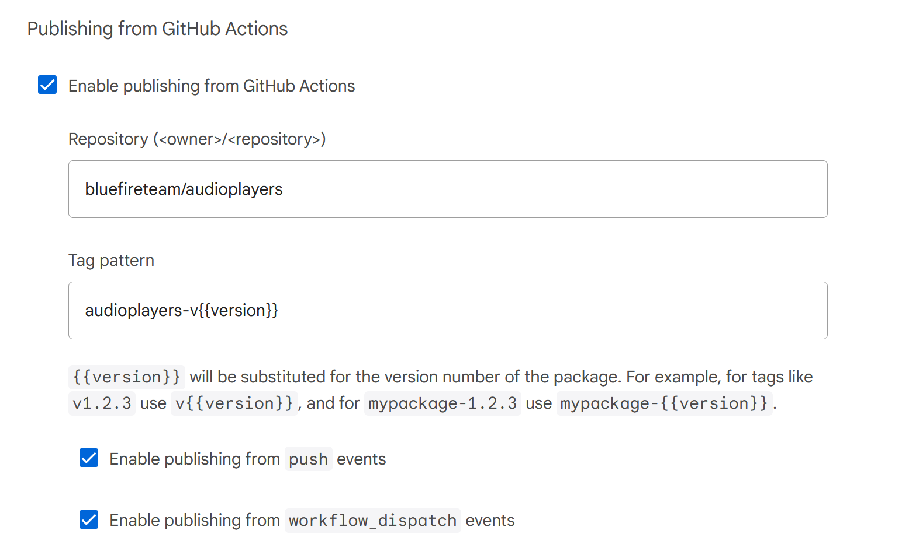
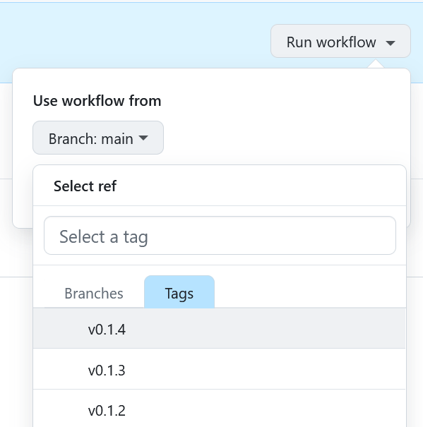

# Melos Action

Activates [Melos](https://github.com/invertase/melos) for your GitHub workflow.
It can also automatically version, dry-run and publish your packages to pub.dev.

NOTE: Remember to check the "Allow GitHub Actions to create and approve pull
requests" checkbox in the bottom of the Actions > General section of your
repository settings if you want to use `create-pr: true`.


## Installation

The `melos-action` needs to have either dart or flutter on the path before it
can activate melos. With this set up it will automatically add melos to your
path and run `melos bootstrap`, for more advanced usa-cases, like automatic
releases, see the [Parameters](#parameters) section.


### With Flutter

```yaml
steps:
- uses: actions/checkout@v4
- uses: subosito/flutter-action@v2
- uses: bluefireteam/melos-action@v3
```


### With Dart

```yaml
steps:
- uses: actions/checkout@v4
- uses: dart-lang/setup-dart@v1
- uses: bluefireteam/melos-action@v3
```


## Parameters

There are a few parameters that can be set to customize the behavior of the
action, they are all optional.

| Parameter                 | Default               | Description                                                                                                  |
| ------------------------- | --------------------- | ------------------------------------------------------------------------------------------------------------ |
| melos-version             | latest                | The version of Melos to activate.                                                                            |
| run-bootstrap             | true                  | Whether to run `melos bootstrap` after activating Melos.                                                     |
| enforce-lockfile          | false                 | Whether the versions in the lockfiles should be enforced.                                                    |
| run-versioning            | false                 | Whether packages should be versioned.                                                                        |
| run-versioning-prerelease | false                 | Whether packages should be versioned as a prerelease.                                                        |
| run-versioning-graduate   | false                 | Whether packages should be versioned while graduating prereleases to stable.                                 |
| include-private           | false                 | Whether to include or exclude packages with `publish_to: "none"`                                             |
| publish-dry-run           | false                 | Whether packages should be dry-run published.                                                                |
| publish                   | false                 | Whether packages should be published to pub.dev.                                                             |
| dart-version              | stable                | The Dart version that should be used for OIDC setup for publishing. Pass in `'none'` to setup this manually. |
| create-pr                 | false                 | Whether to create a PR with the changes made by Melos.                                                       |
| tag                       | false                 | Whether tags for the packages should be created.                                                             |
| git-email                 | contact@blue-fire.xyz | The email to use when committing changes.                                                                    |
| git-name                  | Melos Action          | The name to use when committing changes.                                                                     |

To set a specific parameter you use the `with` keyword in your action, like in
the example below.

```yaml
steps:
  - uses: actions/checkout@v4
  - uses: subosito/flutter-action@v2
  - uses: bluefireteam/melos-action@v3
    with:
      run-bootstrap: false
```


### Set melos version

You can set a version constraint for the melos version if you don't want the
latest version (default).

Simply adding the version, like in the example below, will guarantee that
exactly the specified version is activated.

You can also use all range constraints that exist for pub.
For example `'^1.0.0'` would allow any version from 1.0.0 to 2.0.0 (but not
including 2.0.0). If you want an even tighter restriction you can define the
version like this `'>=1.2.0 < 1.3.0'` which would allow any version between
1.2.0 (included) to 1.3.0 (excluded).

```yaml
steps:
- uses: actions/checkout@v4
- uses: subosito/flutter-action@v2
- uses: bluefireteam/melos-action@v3
  with:
    melos-version: '1.2.0'
```


### Automatic versioning and publishing

It is recommended that you read through and follow the set-up steps at
[dart.dev](https://dart.dev/tools/pub/automated-publishing) before continuing,
not applicable for dry-runs of course. Ensure that **publishing from `workflow_dispatch` events** is enabled:



Remember that if your package isn't already published to pub.dev you need to
manually publish it the first time, after that you can use the action to
automatically publish it.

If you want to semi-automatically release your packages for example when a new PR is
merged you have a few different options:



1. **[Version and release on workflow dispatch:](./examples/01-workflow-dispatch)**
   Create three actions: one which versions and dry-run publishes your packages
   and then creates a release preparation PR when this workflow is triggered. 
   And a second action that creates a tag when the PR is merged and starts the
   release workflow.
   In the third action a dispatch workflow is created to publish the created
   tags to pub.dev.
2. **[Version and release on each PR:](./examples/02-release-on-pr)**
   Create three actions: one which versions and dry-run publishes your packages
   and then creates a release preparation PR every time a PR from a contributor
   is merged. The other two are the same as in 1).
3. **[Only run dry-run versioning and publishing as a check:](./examples/03-check-only)**
   Only use the action to ensure in your pipeline that your packages are
   releasable, i.e. doesn't fail any dry run.


**Note:** Publishing directly from GitHub Actions to pub.dev only works if dispatched from a _tag_, not from a branch.

And this note is worth repeating - Remember to check the "Allow GitHub Actions
to create and approve pull requests" checkbox in the bottom of the
Actions > General section of your repository settings if you want to use
`create-pr: true`.

See the [examples directory](./examples) to get files that you can copy and
paste into your repository.
